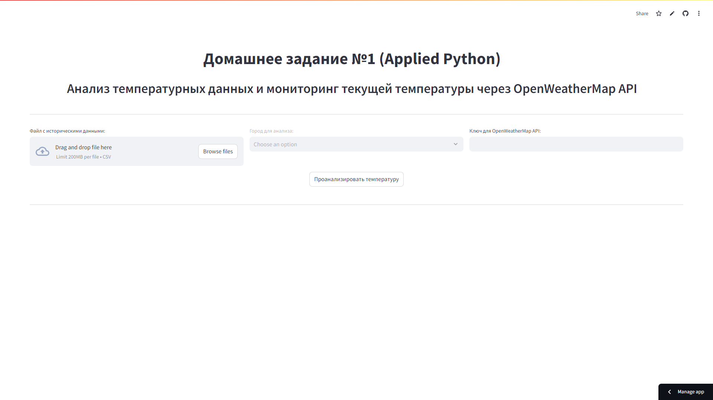
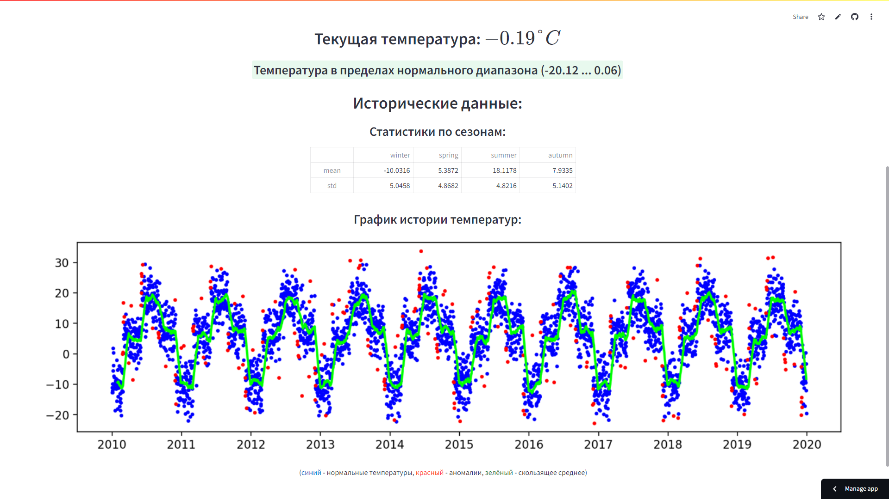

# Домашнее задание №1 (Applied Python)


## Оглавление

- [Описание](#описание)
- [Структура проекта](#структура-проекта)
- [Установка зависимостей](#установка-зависимостей)
- [Локальный запуск Streamlit-приложения](#локальный-запуск-streamlit-приложения)
- [Примеры работы](#примеры-работы)

## Описание

Streamlit-приложение для анализа температурных данных и мониторинга текущей температуры через OpenWeatherMap API.

Приложение развёрнуто на Streamlit Cloud и доступно по [ссылке](https://python-homework-1.streamlit.app/).

## Структура проекта

- `task.ipynb` - Jupyter-ноутбук с описанием задания
- `experiments.ipynb` и `experiments.py` - Jupyter-ноутбук и скрипт с анализом временного ряда и экспериментами
- `app.py` - скрипт с реализацией Streamlit-приложения
- `stats.py` - скрипт с реализацией методов для анализа данных
- `api.py` - скрипт с реализацией взаимодействия с OpenWeatherMap API
- `config.py` - скрипт с конфигурацией проекта
- `README.md` - Markdown-файл с описанием проекта ***(данный файл)***
- `data/` - папка с данными
  - `temperature_data.csv` - CSV-файл с синтетическими данными о температурах
  - `example_1.png` и `example_2.png` - картинки с примерами работы приложения из конца данного файла
- `requirements.txt` - текстовый файл со списком зависимостей проекта
- `.gitignore` - текстовый файл с перечислением исключённых из Git путей

## Установка зависимостей

Команда для установки всех необходимых приложению зависимостей:

```bash
pip install -r requirements.txt
```

## Локальный запуск Streamlit-приложения

Команда для запуска приложения:

```bash
streamlit run app.py
```

После выполнения данной команды запущенное приложение будет доступно по адресу http://localhost:8501/.

## Примеры работы

Основная страница приложения:



Пример результата анализа температур:


